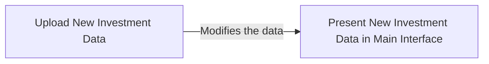

Wealth Manager Copilot is a powerful assistant designed to help wealth managers optimize portfolio management through advanced AI-driven insights. This Copilot integrates a variety of agents, each equipped with specialized tools, allowing for targeted analysis and solutions tailored to unique client needs. With AI-enhanced capabilities, wealth managers can go beyond traditional methods, offering more dynamic, data-driven portfolio recommendations and adjustments.

Our experience has shown that the best Copilots are developed in collaboration with financial experts. These professionals possess the knowledge required to customize tools that align with the specific objectives of their clients and firms. As a result, Wealth Manager Copilot, outfitted with tailored tools, is more effective in meeting client expectations and navigating complex financial challenges.

## Creating an Account

> Creating an account as a wealth manager is easy, it only takes a few steps!

On the main page, locate and click the *"Register"* button in the bottom-left corner. This will take you to a role selection screen. If you are a wealth manager, select the *"Wealth Manager"* option and proceed to enter the required information.

<Frame>
  
</Frame>

After completing the registration process, you will be redirected to the login page. Here, you can enter your credentials to access your account.

After login, you will have a interface that looks like below:

<Frame>
  
</Frame>

Click Data menu in the sidebar.

<Frame>
  
</Frame>

This will direct you to a page where you can upload the necessary data.

<Frame>
  
</Frame>

## Initiate Account Data

**First**, click on the *“Download User Data”* button. This will provide you with a template in the correct format for recording the necessary data:

<Frame>
  
</Frame>

In the user data form, please complete the following columns, leaving the *"Account Number"* field blank, but with no blank lines:
-   **First Name**: The first name of the account owner.
-   **Last Name**: The last name of the account owner.
-   **Date of Birth**: The account owner's date of birth.
-   **Email**: The email address of the account owner.
-   **Phone Number**: The account owner's phone number.
-   **Address**: The residential address of the account owner.
-   **Risk Tolerance**: The client's risk tolerance level (choose one: Low, Medium, High).
-   **Investment Objective**: The client's primary investment objective (choose one: Growth, Income, Capital Preservation, or Speculation).
-   **Portfolio Name**: The name of the portfolio (e.g., "Retirement Fund").
-   **Portfolio Type**: The type of portfolio (select one: Individual, Joint, or Retirement).
-   **Goal**: The target of the portfolio (e.g., "Steady income generation").

> Before uploading the files, ensure that there are no blank lines in the Excel sheet. This will help prevent any errors during the upload process.

**Next**, once you upload the Excel file with the completed information, the system will automatically generate an *“Account Number”* for each account owner. You can then download the updated file with the account numbers included. Example shown below:

<Frame>
  
</Frame>

## Initiate Investment Data

**First**, click on the *“Download Investment Data”* button. This will provide you with a template in the correct format for recording the investment data:

<Frame>
  
</Frame>

In the investment data, please complete the following fields, you should not include any blank lines:

-   **Account Number**: Enter the corresponding account number.
-   **Investment Type**: Select the type of investment (choose one: Stock, Bond, Fund, or ETF).
-   **Investment Symbol**: Provide the ticker symbol or identifier for the investment (e.g., "AAPL").
-   **Investment Name**: Enter the name of the investment (e.g., "Apple Inc.").
-   **Units Held**: Input the number of units or shares held.
-   **Purchase Price**: Specify the price per unit or share at the time of purchase.
-   **Purchase Date**: Record the date the investment was purchased.
-   **Last Traded Price**: Enter the most recent traded price per unit or share.

> Before uploading the files, ensure that there are no blank lines in the Excel sheet. This will help prevent any errors during the upload process.

**Next**, once you've completed the steps above, the account information will be updated. You can verify the details by clicking on the first two buttons in the sidebar. You should see something shown below.

The main interface after uploading both file:

<Frame>
  
</Frame>

The account page after uploading both file:

<Frame>
  
</Frame>

## Modifying Portfolio Information

You can modify the assets in each portfolio by following the same steps outlined earlier for uploading investment data. Simply update the necessary fields in the Excel file and re-upload it to reflect the changes.

The workflow of this process looks like below:

### Update Account Data

To update existing account data, edit the original uploaded file by entering the new information. For new accounts, leave the "Account Number" field blank. Please ensure the following fields are completed:

-   **First Name**: The first name of the account owner.
-   **Last Name**: The last name of the account owner.
-   **Date of Birth**: The account owner's date of birth.
-   **Email**: The email address of the account owner.
-   **Phone Number**: The account owner's phone number.
-   **Address**: The residential address of the account owner.
-   **Risk Tolerance**: The client's risk tolerance level (choose one: Low, Medium, High).
-   **Investment Objective**: The client's primary investment objective (choose one: Growth, Income, Capital Preservation, or Speculation).
-   **Portfolio Name**: The name of the portfolio (e.g., "Retirement Fund").
-   **Portfolio Type**: The type of portfolio (select one: Individual, Joint, or Retirement).
-   **Goal**: The target of the portfolio (e.g., "Steady income generation").

The updated file should look like below:

<Frame>
  
</Frame>

Once you have filled in the necessary details, upload the updated file through the portal.

<Frame>
  
</Frame>

> Make sure you keep all the existing accounts and add the new account in the file.

### Update Investment Data
To update your investment data, follow these steps:

1. Click *"Download User Data"* to retrieve the corresponding account number. You should get a file that looks like below:

<Frame>
  
</Frame>

2. Enter the new investment details into the original uploaded file. Make sure the following fields are completed:

    -   **Account Number**: Enter the corresponding account number.
    -   **Investment Type**: Select the type of investment (choose one: Stock, Bond, Fund, or ETF).
    -   **Investment Symbol**: Provide the ticker symbol or identifier for the investment (e.g., "AAPL").
    -   **Investment Name**: Enter the name of the investment (e.g., "Apple Inc.").
    -   **Units Held**: Input the number of units or shares held.
    -   **Purchase Price**: Specify the price per unit or share at the time of purchase.
    -   **Purchase Date**: Record the date the investment was purchased.
    -   **Last Traded Price**: Enter the most recent traded price per unit or share.

3. Once updated, upload the file through this portal.

<Frame>
  
</Frame>

## Analyze & Chat

Once you have imported all the necessary data, navigate to the main interface. If the data was updated successfully, the interface should resemble the following:

<Frame>
  
</Frame>

Next, click the *"Accounts"* button in the sidebar. You will then see the following:

<Frame>
  
</Frame>

After selecting any individual account, you will see a screen similar to the following:

<Frame>
  
</Frame>

Click the *"Analyze"* button located in the top right corner to begin analyzing your data through a conversation with the copilot.

<Frame>
  
</Frame>

> All data presented in this example are for illustrative purposes only and do not constitute investment advice or guidance. The information provided should not be used for decision-making or relied upon as an indicator of actual market performance.